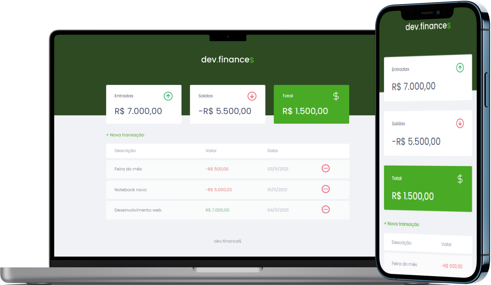

<h1 align="center">
	
</h1>

<p align="center">
   <a href="#-Projeto">Projeto</a>&nbsp;&nbsp; | &nbsp;&nbsp;
   <a href="#-Tecnologias">Tecnologias</a>&nbsp;&nbsp; | &nbsp;&nbsp;
   <a href="#-Layout">Layout</a>&nbsp;&nbsp; | &nbsp;&nbsp;
</p>

<p align="center">
  
</p>

## 💻 Projeto
<p>É uma aplicação de controle financeiro, onde o usuário poderá cadastrar as entradas e saídas realizadas. Há possibilidade de remover os valores inseridos, e o balanço atualiza automaticamente após a alteração. Também possui um modal para cadastro de novas transações.</p>

## 🔖 Sobre
<p>O projeto teve como objeto exercitar meus conhecimentos em Desenvolvimento web no geral. </p>

## 🚀 Tecnologias
Tecnologias utilizadas durante o projeto:
- HTML
- CSS
- JavaScript

## 🎨 Layout
Para visualização completa do design utilizado, crie uma conta no Figma e duplique o layout: [Layout dev.finances](https://www.figma.com/file/7Vu9DzUaCZIV4nibzkjgB4/dev.finance-Maratona-Discover/duplicate).

## 👩‍💻 Prática
Clonar o projeto:
```bash
$ git clone https://github.com/FernandNsp/Discover-DevFinances.git
````

## 📄 License
Esse projeto está sob a licença MIT. Para mais detalhes acesse o arquivo [LICENSE](https://github.com/FernandNsp/Discover-DevFinances/blob/main/LICENSE.md).